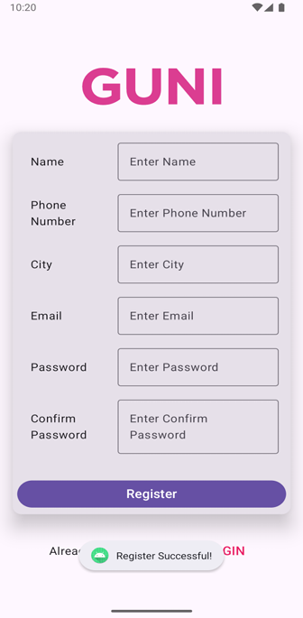

# JetPack Authentication App

An android authentication application built with Jetpack Compose, featuring login and registration screens with navigation.

## Features

- User-friendly login interface
- Complete registration form with validation
- Navigation between login and registration screens
- Material Design 3 theming
- Reusable form components
- Edge-to-edge display support
- Password field with masking
- Numeric input validation for phone numbers

## Tech Stack

- **Kotlin** - Primary programming language
- **Jetpack Compose** - Modern declarative UI toolkit
- **Material Design 3** - UI components and theming
- **Navigation Compose** - Screen navigation management
- **Android Architecture Components** - Activity and lifecycle management

## Project Structure

```
com.example.jetpack
├── MainActivity.kt              # Main activity with navigation setup
├── screen
│   ├── LoginScreen.kt          # Login UI implementation
│   ├── Register.kt             # Registration UI implementation
│   └── components
│       └── FormField.kt        # Reusable form field component
└── ui.theme
    ├── Color.kt                # Color definitions
    ├── Theme.kt                # Theme configuration
    └── Type.kt                 # Typography settings
```

## Screens

<div align="center">
  <table>
    <tr>
      <td align="center"><b>Login Screen</b></td>
      <td align="center"><b>Register Screen</b></td>
    </tr>
    <tr>
      <td></td>
      <td></td>
    </tr>
  </table>
</div>


### Components

### FormField
A reusable composable component that provides:
- Text input with external label
- Password field variant with masking
- Numeric input variant with digit-only validation
- Consistent styling and spacing

## Getting Started

### Prerequisites
- Android Studio (latest version recommended)
- Android SDK (minimum SDK 21)
- Kotlin plugin

### Installation

1. Clone the repository
2. Open the project in Android Studio
3. Add the required drawable resource:
   - Place `guni_pink_logo` in `res/drawable`
4. Sync Gradle files
5. Run the application on an emulator or physical device

### Dependencies

Add the following dependencies to your `build.gradle.kts` file:

```kotlin
dependencies {
    implementation("androidx.core:core-ktx:1.12.0")
    implementation("androidx.activity:activity-compose:1.8.2")
    implementation("androidx.compose.ui:ui:1.6.0")
    implementation("androidx.compose.material3:material3:1.1.2")
    implementation("androidx.navigation:navigation-compose:2.7.6")
}
```


## Navigation Routes

- `LoginScreen` - Default starting destination
- `Register` - Registration screen


## Author

**Aashish Sah**  
- GitHub: [@aashishsah005](https://github.com/aashishsah005)
- Email: aashishsah005@gmail.com

---

## Acknowledgments

- Android Documentation for AlarmManager APIs
- Material Design Guidelines
- Stack Overflow Community
- Android Developers YouTube Channel

---

## Support

If you found this project helpful, please give it a ⭐ on GitHub!

---